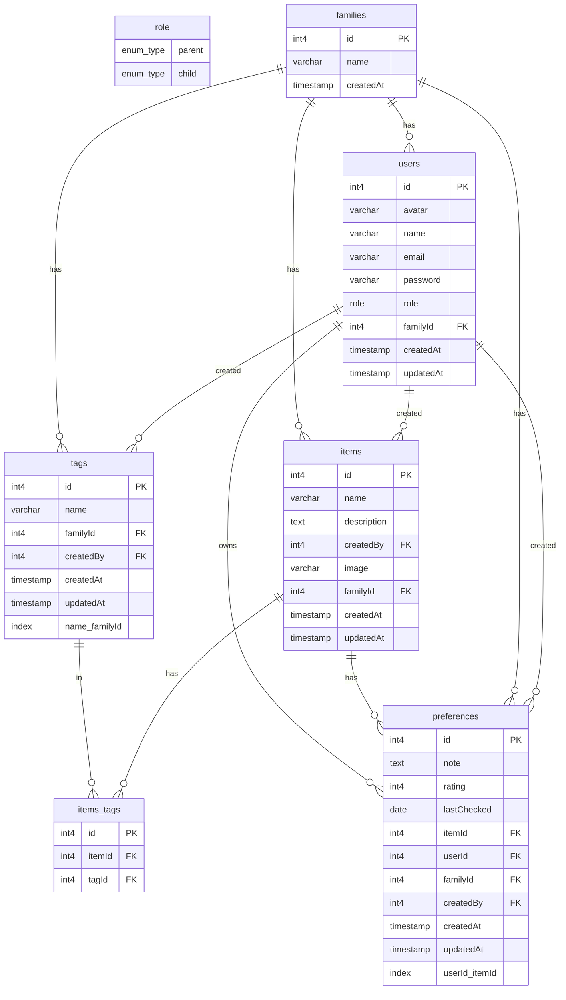

# Toddler Likes App

A modern application to help parents track their toddler's likes and dislikes. It will be available on both desktop and mobile. It is built with a modern tech stack with Typescript throughout.

---

You can see the current Database plan [here](https://dbdiagram.io/d/Toddler-App-6791708637f5d6cbeb9e6e14).



## Tech Stack

### Backend

- [NodeJS](https://nodejs.org/en)
- [Express](https://expressjs.com/)
- [Drizzle ORM](https://orm.drizzle.team/)

### Mobile

- [Expo](https://expo.dev/)
- [Gluestack UI](https://gluestack.io/)
- [React Native](https://reactnative.dev/)

## Getting Started

### Create .env file

In each directory, copy the `.env.sample` and create `.env`

```
cp .env.sample .env
```

### Run the backend API

#### Install dependencies

```
npm install
```

#### Run it

```
npm run dev
```

#### Generate and migrate the database tables

```
npx drizzle-kit push
```

#### Seed the database

```
npm run db:seed
```

#### See your database

```
npm run db:studio
```

Visit your [local Drizzle Studio](https://local.drizzle.studio/) to see your data
